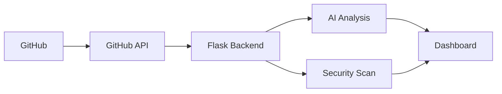

# 🚀 GitPulse – AI Powered GitHub Team Intelligence Platform

> Monitor • Analyze • Secure • Improve Your GitHub Repositories with AI

## About
GitPulse is an AI-powered GitHub monitoring platform built with Python and Flask. It provides repository analytics, developer insights, AI recommendations, and security scanning.

## Features
- GitHub OAuth Authentication
- Repository Analytics
- Commit / PR / Issue Tracking
- AI Insights
- Secret Detection
- Security Scanner
- Dashboard
- Email Notifications

## Tech Stack
- Python
- Flask
- HTML, CSS, JavaScript
- Bootstrap
- GitHub API
- Claude AI API

## Installation
```bash
git clone https://github.com/aishumara2005/GitPulse.git
cd GitPulse
pip install -r requirements.txt
python app.py
```

## Architecture


## Contributors

| Name | Role |
|------|------|
| Aiswarya Maravarman | Project Lead |
| Arun | Contributor |

GitHub:
- https://github.com/aishumara2005
- https://github.com/Arun15226

## Badges
Replace YOUR_REPOSITORY below.

```md


```

## GitHub Stats
```md


```

## Visitor Counter
```md

```

## Activity Graph
```md

```

## License
MIT License

## Contact
- GitHub: https://github.com/aishumara2005
- LinkedIn: https://www.linkedin.com/in/aiswarya-maravarman-8a5550371/
