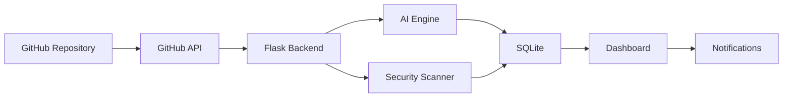

# 🚀 GitPulse -- AI Powered GitHub Team Intelligence Platform

> **Monitor • Analyze • Secure • Improve**


------------------------------------------------------------------------

## 📌 Project Overview

GitPulse is an AI-powered GitHub Team Intelligence Platform that helps
developers and organizations monitor repositories, analyze contributor
activity, scan code for security issues, and generate AI-powered
insights through an interactive dashboard.

## ✨ Features

-   🔐 GitHub OAuth Authentication
-   📊 Repository Analytics
-   👥 Contributor Insights
  AI Recommendations
-   🛡️ Security & Secret Scanner
-   📈 Interactive Dashboard
-   📧 Email Notifications
-   📂 Multi-Repository Ready

## 🏗️ Workflow

``` text
GitHub Repository
        │
        ▼
 GitHub API
        │
        ▼
 Flask Backend
        │
 ┌──────┴────────┐
 ▼               ▼
AI Analysis  Security Scan
 └──────┬────────┘
        ▼
 Analytics Dashboard
        ▼
 Email Notifications
```

## 🖼️ Architecture



## 🛠️ Tech Stack

  Category   Technologies
  ---------- ----------------------------------
  Frontend   HTML, CSS, Bootstrap, JavaScript
  Backend    Python, Flask
  AI         Claude API
  APIs       GitHub REST API
  Database   SQLite

## 📂 Project Structure

``` text
GitPulse/
├── app.py
├── ai_analyzer.py
├── github_api.py
├── security_scanner.py
├── templates/
├── static/
├── requirements.txt
└── README.md
```

## ⚙️ Installation

``` bash
git clone https://github.com/aishumara2005/GitPulse.git
cd GitPulse
pip install -r requirements.txt
python app.py
```
---

## ⚡ See GitPulse in Action


# 👥 Meet the Team

<p align="center">
  <b>The passionate minds behind GitPulse 🚀</b>
</p>

<table align="center">
<tr>

<td align="center" width="50%">

<a href="https://github.com/aishumara2005">


### 👩‍💻 M. Aiswarya

**🌟 Founder & Project Lead**

AI & Data Science Engineer

🏗️ System Architecture

🤖 AI Integration

⚙️ Backend Development

📊 Dashboard Design

<a href="https://github.com/aishumara2005">

</a>

<a href="https://www.linkedin.com/in/aiswarya-maravarman-8a5550371/">

</a>

</td>

<td align="center" width="50%">

<a href="https://github.com/Arun15226">


### 👨‍💻 Arun

**🚀 Project Contributor**

Frontend Development

🔒 Security Module

🧪 Testing & Debugging

🛠️ Feature Enhancement

<a href="https://github.com/Arun15226">

</a>

<a href="https://www.linkedin.com/in/kausik-arun-33626641b">

</a>

</td>

</tr>
</table>

---

## 📜 License

MIT License

## 📬 Contact

-   GitHub: https://github.com/aishumara2005
-   LinkedIn: https://www.linkedin.com/in/aiswarya-maravarman-8a5550371/
  
